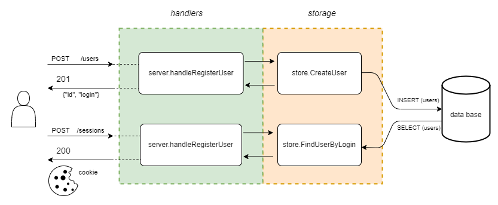

# keeper - система для хранения приватных данных

- [Общая информация](#info)
- [Архитектура](#arch)
  - [Блок-схемы](#arch-scheme)
    - [Регистрация/Логин](#arch-scheme-auth)
    - [Добавление/Получение приватных данных](#arch-scheme-privatedata)
    - [Загрузка/Скачивание файлов](#arch-scheme-files)
  - [Схема БД](#arch-db)

- [Работа приложения](#operation)
  - [Конфигурация сервера](#operation-config-server)
  - [Клиент](#operation-client)
    - [Регистрация пользователя](#operation-client-register)
    - [Логин](#operation-client-login)
    - [Произвольные текстовые данные](#operation-client-text)
    - [Пары логин/пароль](#operation-client-pair)
    - [Банковские карты](#operation-client-bankcard)
    - [Файлы](#operation-client-file)
  - [Запуск приложения](#operation-run)
    - [Запуск сервера](#operation-run-server)
    - [Запуск клиента](#operation-run-client)
- [Дальнейшее развитие проекта](#todo)

# Общая информация <a name="info"/>
keeper - система для хранения приватных данных: тексты, пароли, данные банковских карт, файлы

# Архитектура <a name="arch"/>

## Блок-схемы <a name="arch-scheme"/>

### Регистрация/Логин <a name="arch-scheme-auth"/>


### Добавление/Получение приватных данных <a name="arch-scheme-privatedata"/>


### Загрузка/Скачивание файлов <a name="arch-scheme-files"/>


## Схема БД <a name="arch-db"/>


Подробнее [migrations/01_keeper.sql](migrations/01_keeper.sql)


# Работа приложения <a name="operation"/>
## Конфигурация сервера <a name="operation-config-server"/>

Параметры конфигурация сервиса keeper определяются либо файлом конфигурации, либо флагами командной строки, либо переменными окружения.

| Переменная окружения           | Флаг командной строки | Описание                                      |
|--------------------------------|-----------------------|-----------------------------------------------|
| `CONFIG_KEEPER`                |`-c;--config <file>`   | путь к файлу конфигурации                     |
| `ADDRESS`                      | `-a <host:port>`      | адрес и порт сервиса                          |
| `DATABASE_DSN`                 | `-d <dsn>`            | адрес для подключения к базе данных           |
| `SESSION_KEY`                  | _нет_                 | ключ для аутентификаиции                      |

## Клиент <a name="operation-client"/>

Клиент представляет собой CLI-приложение.  
Сценарий работы клиента конфигурируется флагом-командой и соответствующим флагами-аргументами.  
  
Шаблон вызова: `$keeper-client --action=<команда> [<флаги-аргументы>]`  
  
### Регистрация пользователя <a name="operation-client-register"/>  
```
команда:
--action=register

    флаги-аргументы:
    --user  
    --password  

Пример:  
$ keeper-client --action=register --user=someuser --password=secret
```
  
### Создание сессии пользователя <a name="operation-client-login"/>  
```
команда:
--action=login

    флаги-аргументы:
    --user  
    --password

Пример:  
$ keeper-client --action=login --user=someuser --password=secret
```  
  
### Произвольные текстовые данные <a name="operation-client-text"/>  
```
флаг-команда:
--action=text

    флаги-аргументы:
    --content  
    --metadata        дополнительная информация (текстовые данные)

Примеры:
// Добавить произвольный текст
$ keeper-client --action=text --content="some text" --metatdata="some metadata"

// Получить все тексты авторизованного пользователя
$ keeper-client --action=text
```  
  
### Пары логин/пароль <a name="operation-client-pair"/>  
```
флаг-команда:
--action=pair

    флаги-аргументы:
    --user
    --password
    --metadata        дополнительная информация (текстовые данные)

Примеры:
// Добавить пару логин/пароль
$ keeper-client --action=pair --user="newuser" --password="newpassword" --metatdata="some metadata for new user"

// Получить все пары логин/пароль
$ keeper-client --action=pair
```  
  
### Банковские карты <a name="operation-client-bankcard"/>  
```
флаг-команда:
--action=card

    флаги-аргументы:
    --pan           PAN - Номер платежной карты
    --till          Valid Thru Date - дата истечения срока действия карты, указанная на поверхности карты 
    --cvv           CVC/CVV — коды верификации пластикового носителя, которые подтверждают его подлинность
    --name          Имя владельца карты, напечатанное на лицевой стороне карты

    --metadata      дополнительная информация (текстовые данные)

Примеры:
// Добавить данные банковской карты
$ keeper-client --action=card --pan="4321 6543 3214 8766" --till="11/23" --cvv="123" --name="JOHN SMITH" --metatdata="some metadata for new user"

// Получить все данные банковских карт
$ keeper-client --action=card
```  

### Файлы <a name="operation-client-file"/>  
```
флаг-команда:
--file

    флаги-аргументы:
    --upload          загрузить файл на сервер
    --download        скачать файл

    --metadata        дополнительная информация (текстовые данные)
Примеры:
// Загрузить файл
$ keeper-client --action=file --upload=/path/to/file --metatdata="some file for upload"

// Скачать файл
$ keeper-client --action=file --download="file"

// Получить список загруженных на сервер файлов
$ keeper-client --action=file
```  
  
## Запуск приложения <a name="operation-run">  
Подготовка частей приложения, тестирование, и запуск выполняется с помощью команды make.  
В Makefile определены основные команды для управления приложением. 
  
Подробнее [Makefile](Makefile)  
  
### Запуск сервера <a name="operation-run-server">    
- Создание и запуск контейнеров с приложением и базой данных:  
`$ make docker-keeper-up`  
  
### Запуск клиента <a name="operation-run-client">  
- Генерация бинарного файла клиента:  
`$ make build-client`  
  
После генерации, бинарный файл клиента находится в директории `bin/`.  
Например, команда клиента для регистрации пользователя выглядит так:  
`$ ./bin/keeper-client --register --user=newuser --password=secret`  
  
# Дальнейшее развитие проекта <a name="todo"/>
Можно добавить в приложение следующий функционал:
- Возможность редактирования/удаления объектов
- Поддержка терминального интерфейса для клиента
