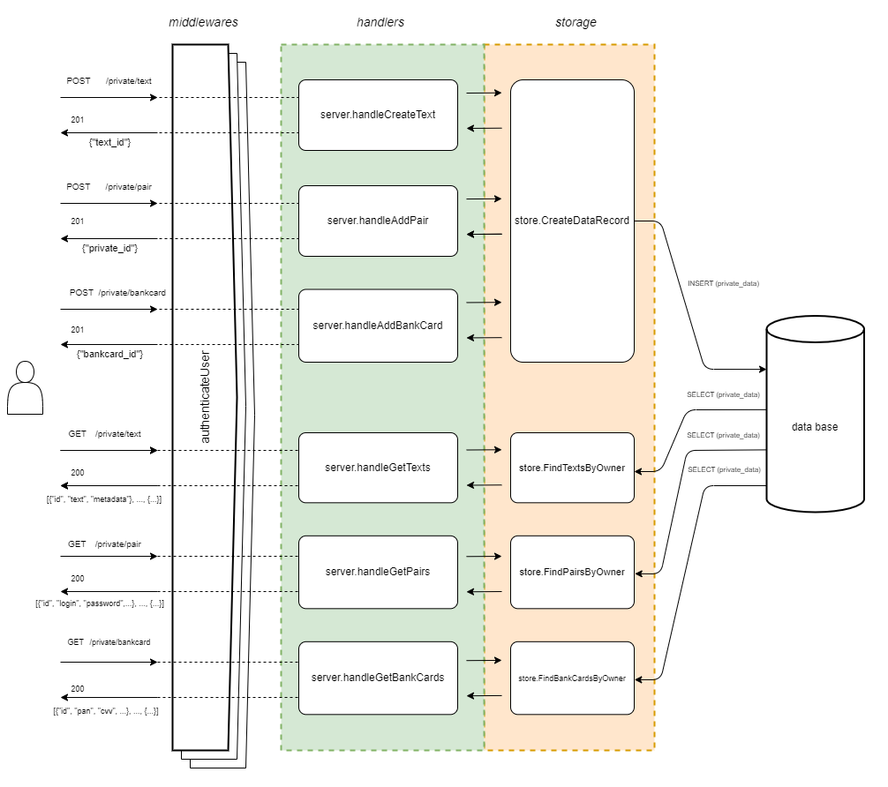
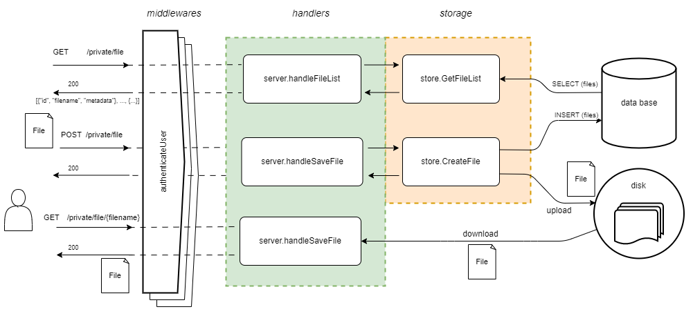
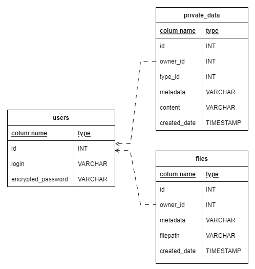

# keeper - система для хранения приватных данных

- [Общая информация](#info)
- [Архитектура](#arch)
  - [Блок-схемы](#arch-scheme)
    - [Регистрация/Логин](#arch-scheme-auth)
    - [Добавление приватных данных](#arch-scheme-privatedata)
    - [Загрузка файлов](#arch-scheme-files)
  - [Схема БД](#arch-db)

- [Конфигурация сервера](#config)

# Общая информация <a name="info"/>
keeper - система для хранения приватных данных: тексты, пароли, данные банковских карт, файлы

# Архитектура <a name="arch"/>

## Блок-схемы <a name="arch-scheme"/>

### Регистрация/Логин <a name="arch-scheme-auth"/>

### Добавление приватных данных <a name="arch-scheme-privatedata"/>

### Загрузка файлов <a name="arch-scheme-files"/>

## Схема БД <a name="arch-db"/>

Подробнее [migrations/keeper.sql](migrations/keeper.sql)

## Конфигурация сервера <a name="config"/>

Параметры конфигурация сервиса keeper определяются либо файлом конфигурации, либо флагами командной строки, либо переменными окружения.

| Переменная окружения           | Флаг командной строки | Описание                                      |
|--------------------------------|-----------------------|-----------------------------------------------|
| `CONFIG_KEEPER`                |`-c;--config <file>`   | путь к файлу конфигурации                     |
| `ADDRESS`                      | `-a <host:port>`      | адрес и порт сервиса                          |
| `DATABASE_DSN`                 | `-d <dsn>`            | адрес для подключения к базе данных           |
| `SESSION_KEY`                  | _нет_                 | ключ для аутентификаиции                      |
